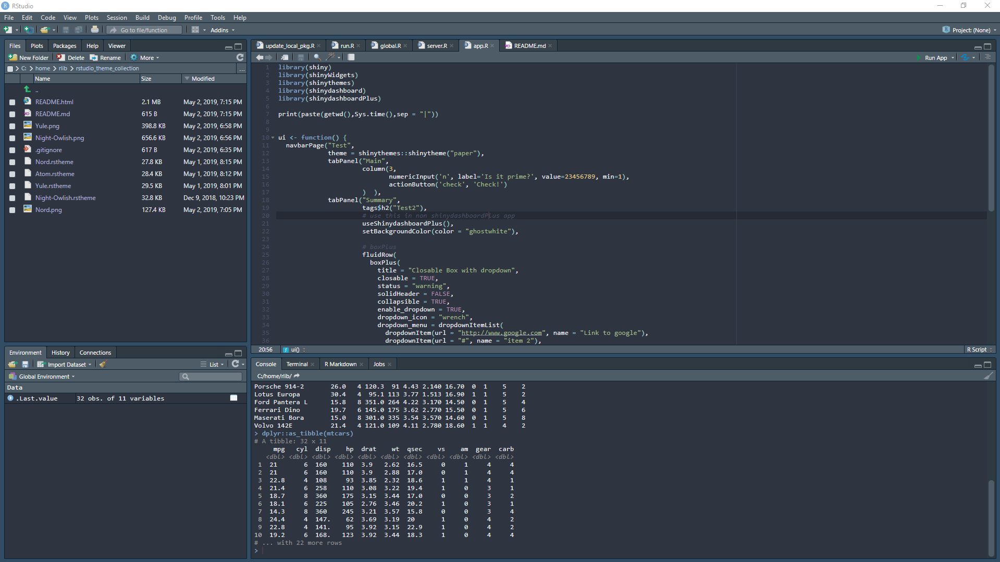
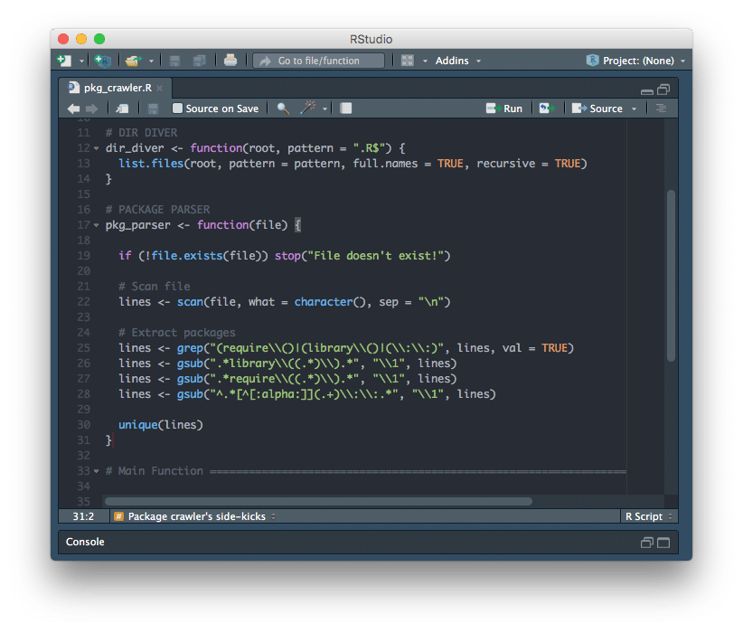
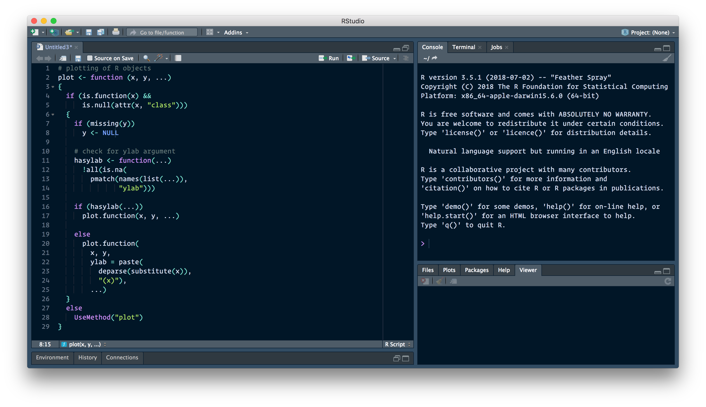
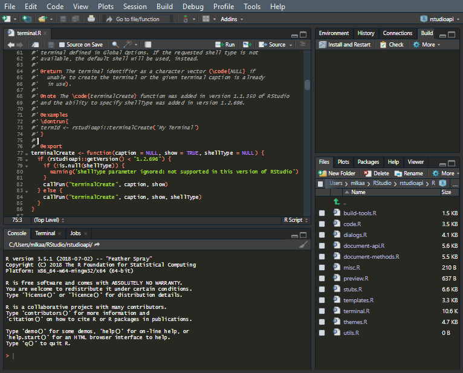
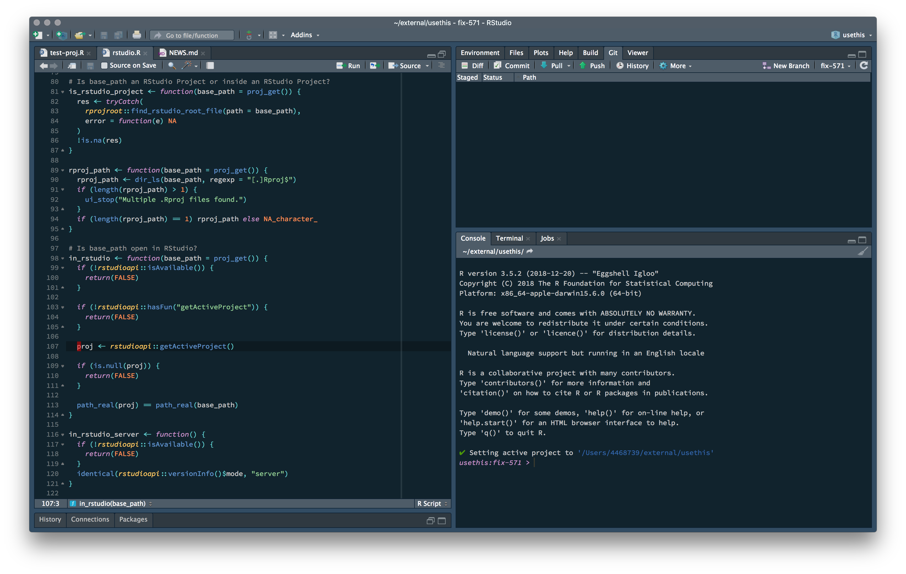

# Rstudio theme collection

RStudio v1.2 has added support for custom editor themes [blog post here](https://blog.rstudio.com/2018/10/29/rstudio-ide-custom-theme-support/).
To create the personal Themes there's an online [tmTheme editor](https://tmtheme-editor.herokuapp.com/#!/editor/theme/Monokai)

A list of dark themes:

- [Nord](Nord.rstheme) by [janusvm](https://github.com/janusvm/nord-rstudio)

  
- [Atom](Atom.rstheme) by [tkrabel](https://github.com/tkrabel/rstudio_atom_theme)

  
- [Yule](Yule.rstheme) by [gadenbuie](https://github.com/gadenbuie/yule-rstudio)

  
- [Night-Owlish](Night-Owlish.rstheme) by [batpigandme](https://github.com/batpigandme/night-owlish)

  
- [Wombat](Wombat.rstheme) by [randy3k](https://github.com/randy3k/dotfiles/tree/master/.R/rstudio/themes)

  
- [Grubber](Grubber.rstheme) by [RobertMyles](https://github.com/RobertMyles/grubber)

  
- [Oceanic-Eighties](Oceanic-Eighties.rstheme) by [gadenbuie](https://github.com/gadenbuie/oceanic-eighties)

  
- [Apprentice](Apprentice.rstheme) by [FvD](https://github.com/FvD/rsApprentice)

  
- [VSCode](rscodeio.rstheme) by [anthonynorth](https://github.com/anthonynorth/rscodeio)

  